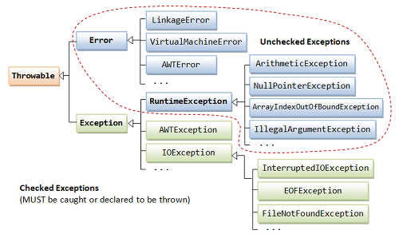

- java 예외구조  
  
- [예외처리 try-catch](../workspace/220617-01_exception/src/Main.java)
  - at메인메소드
    - Exception은 super class~ <- (upcasting) NullPointerException ArithmeticException등등
	- [catch중복이 가능하나, 그 순서에 유의](../workspace/220617-01_exception/src/Main2.java)
	- [finally](../workspace/220617-01_exception/src/Main3.java) : 예외가 발생하든 하지않든 무조건 실행되어야 할 것은 finally 중괄호에 넣음!!!  
  - [at메소드](../workspace/220617-01_exception/src/Main5.java) 
    - 메소드 body자체에 `throw 던질예외객체생성`과정이 존재! ->메소드이름 뒤에 `throws 던질예외객체이름`
- 나만의 예외 만들기
    - 조건을 주고 throw하면 나만의 예외상황을 만들 수 있다. 
	```java  
	if (전혀 널포인터익셉션이 아니라도) throw new NullPointerException();  
	```  
	- 새로운 나만의 Exception클래스 만들기도 가능. [새로만든거](../workspace/220617-01_exception/src/MyException.java), [적용](../workspace/220617-01_exception/src/Main5.java)   
	```java  
	class 이게날씨냐예외 extends Exception {
		이게날씨냐예외만의 특징을 주고싶음 주면됨
	}
	//메인메소드에서,
	try {
		if (기온30도이상으면) throw new 이게날씨냐예외();
	} catch (이게날씨냐예외 a) {
		System.out.println("진짜 너~~무더워");
	}
	```
	- 새로운 Exception클래스 생성시, RuntimeException를 상속했다면 컴파일에러 안냄!->실행에러 (unckecked exception라서)
- [String 이외 문자열을 다루는 클래스](../workspace/220617-02_otherString/src/Main6.java)
  - String : 문자열이 바뀔 때 마다 새로운 인스턴스 생성 -> 공간차지가 크다는 단점  
  - StringBuilder & StringBuffer : 동일한 인스턴스에 덮어 씀 -> 효율좋음   
    - 객체생성 후, `.append(추가할String)`을 이용해서 합연산  
	- char배열 구조라서 `.replace(start, end, str)`, `.insert(offset, str)`등등 메소드도 많음
    - 이 둘은 (multi thread) (single thread) 차이
  - StringJoiner : 합연산도 되면서, 출력값 꾸미기까지!  
    - `StringJoiner sj = new StringJoiner(",")` -> 사이사이에 ,를 끼워넣겠다~
	- `.add(추가할String)`하면 추가된 string들 사이에 ,가 넣어져서 나옴~ㅎㅎ
  - [StringTokenizer](../workspace/220617-02_otherString/src/Main7.java) : 문자열 분리 (String의 split메소드 유사)  
    - `StringTokenizer st = new StringTokenizer(str, " ");` -> 공백을 기준으로 잘라내겠다~!
	- `.hasMoreTokens()`과 `.nextToken()`, `.countTokens()`

----
> 마무리문제  
> : [은행계좌 프로그램](../workspace/220617-01_exception/src/Account.java) -> 잔고보다 더 출금하면 예외출력  
> : [금요일에만나요](../workspace/220617-02_otherString/src/Main8.java)
