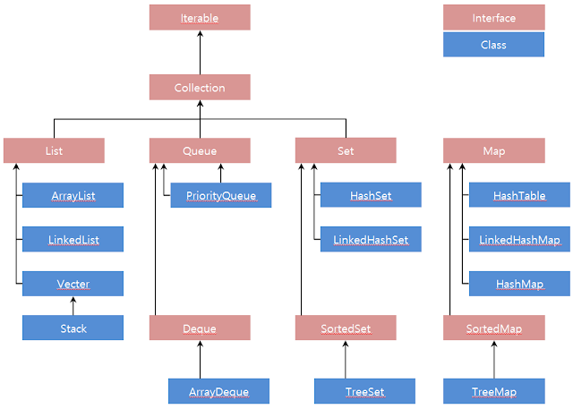

  
- Collection : 자료구조들의 상위인터페이스!
  - 자료구조 : Set, List, Map, Queue ...
  - collection 제공 기능
    - `size()`, `isEmpty()`, `contains(Object o)`, `add(element)`, `remove(Object o)`
	- `addAll(Collection)`, `containsAll(Collection)`, `removeAll(Collection)`, `clear()`
	- `Object[] toArray()`
	- `Iterator<E> iterator();` <- Iterable인터페이스를 상속받은 Collection이니깐~
	  - `hasNext()`, `next()`, `remove()`
	  - 위에서 remove를 하면 최근에 next()로 반환된 원소를 삭제하는데, 이는 원본에도 영향을 줌 (★같은참조)
  - 전부 제네릭이 사용가능하다~ -> [제네릭 사용이유?](../workspace/220620-01_arraylist/src/Main2.java)
- List (인터페이스임) : 배열과 달리 길이에 구애받지 않고 사용가능
  - [List 제공 기능](../workspace/220620-01_arraylist/src/Main3.java)
    - `get(index)`, `set(index, element)`, `indexOf(element)`, `add(index, element)`
	- `subList(from, to)` -> list로 반환
  - [ArrayList (실제로 구현한 클래스)](../workspace/220620-01_arraylist/src/Main.java)
    - [Collections는 Collection에서 작동하는 정적 메소드들이 담겨있다~](../workspace/220620-01_arraylist/src/Main6.java) 
	  - Collections.sort(list) -> Collections.binarySearch(list, 찾는값)
	  - Collections.reverse(list), Collections.shuffle(list)
	  - Collections.max(list), Collections.min(list)
	  - Collections.fill(list, 바꿀값) -> 전부 다 바꾸는거임 길이유지
	  - Collections.replaceAll(list, 찾을값, 바꿀값) -> 찾아서 걔들을 다 바꿀값으로 바꿈
	  - Collections.copy(복사종이list, 원본list) -> 원본list 0index부터~ 이게 복사종이list에 겹쳐써짐
	- Arrays에는 배열에서 작동되는 정적 메소드들이 담겨있다~
	  - Arrays.sort(arr) -> Arrays.binarySearch(arr, 찾는값)
	  - Arrays.equals(arr1, arr2)
	  - [Arrays.asList(값... )](../workspace/220620-01_arraylist/src/Main5.java) -> ★asList로 생성된 list는 값 추가 변경 불가!!!
	  - **비교** ★ArrayList(Arrays.asList(값... ))을 통해 생성된 arraylist는 값 추가 변경 가능!!!
	- 보편적으로 배열을 정렬할 땐 Arrays.sort(), 컬렉션(List,Set..)을 정렬할 땐 Collections.sort()를 사용
  - [list중 일부만 삭제하고 싶을때](../workspace/220620-01_arraylist/src/Main4.java)
    - for문? remove로 인덱스가 자꾸바뀌니깐 별로
    - for-each문? 출력만 할 때 써라 이건  
	- iterator! 컬렉션의 원소들 차례로 방문
----
> 마무리문제  
> 1. [0~10사이의 난수 6개를 가지는 리스트](../workspace/220620-01_arraylist/src/T0620.java)  
> 2. [중복되는 원소 중 하나만 삭제](../workspace/220620-01_arraylist/src/T0620_2.java)  
> 3. ['정수형태의 값'을 가지는 문자열만 Integer형으로 변환](../workspace/220620-01_arraylist/src/T0620_3.java)  
> 4. [과일가게](../workspace/220620-01_arraylist/src/T0620_4.java)
