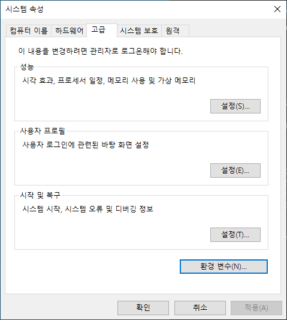
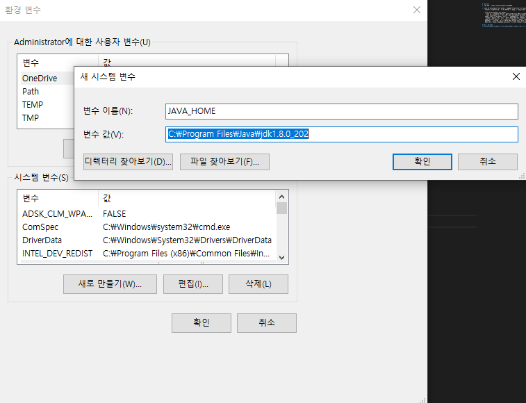
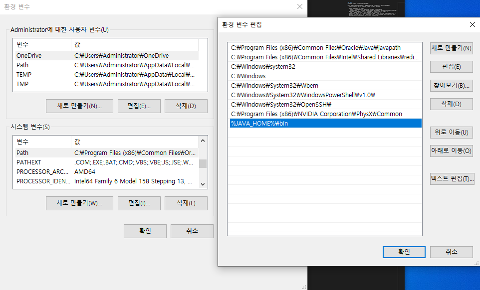

# JDK 설치
1. jdk 8을 검색하여 oracle사이트로 들어간다.

2. Java SE Development Kit 8u202 -> 자신의 운영체제에 맞는 설치파일 다운 (로그인 필요)  
    - 운영체제 알아보는 법 : 내 PC 우클릭 -> 속성 -> 시스템 종류 확인

    - Java SE Development Kit 8u202?  
       - java se : standard edition. 자바 언어의 핵심 기능 제공하는 에디션
       - java developmet kit : 이게 JDK. 자바 프로그램을 실행하기 위한 JRE(java runtime environment)뿐만 아니라 자바 개발에 필요한 컴파일러, 디버거와 같은 명령어 개발도구를 추가 한 것.
       - 8u202 : 버전 8. 현재 17까지 나왔음에도 버전 8을 이용하는 이유?  
    18년 오라클이 자바를 유료 구독형으로 개편하면서, 버전 8 이후부터는 보안 업데이트가 6개월 까지만 가능하게 변경되었다.  
    -> JDK 8 버전 이상을 무료( Free )로 이용하기 위해서는 오라클이 아닌 Open JDK ( https://openjdk.java.net/ )를 이용하면 된다.

# 환경변수 설정
> 환경변수를 설정하는 이유?  
> : cmd에서 java파일을 컴파일 하기위해 javac를 실행시켜야 하는데,  
> cmd는 현재 디렉토리에서 실행파일을 찾기 때문에 매번 javac가 있는 디렉토리로 찾아가야 하는 불편함이 있다.  
> 하지만 javac가 있는 경로를 환경변수로 등록해 놓으면, cmd가 자동으로 그 경로를 훑고 오기 때문에 편함~
1. 내 PC 우클릭 -> 속성 -> 고급 시스템 설정 -> 환경 변수  

2. Java폴더가 있는 경로를 JAVA_HOME이라는 이름의 변수로 등록

3. Path에 javac가 있는 경로를 2에서의 변수를 사용하여 등록 (%를 이용)

